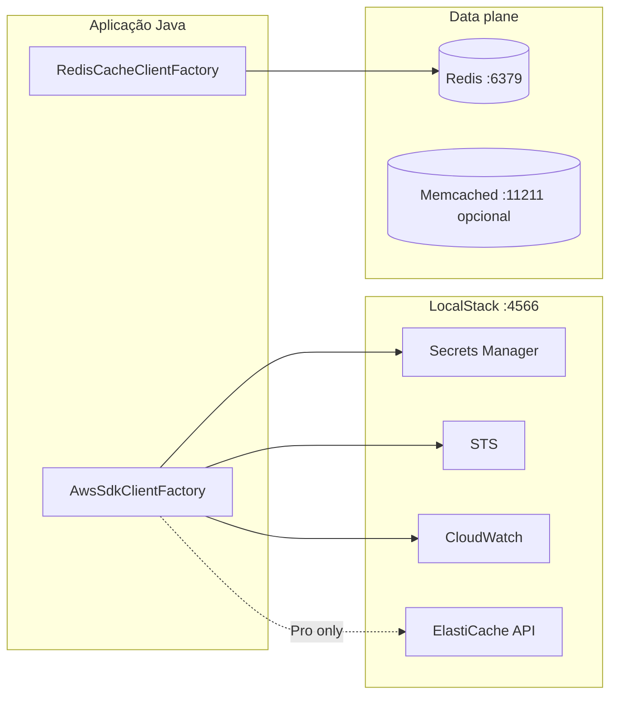

# Ambiente local — LocalStack

Este documento descreve a stack Docker para desenvolvimento local, a matriz de serviços AWS
emulados e as limitações da edição **Community** do LocalStack (validado em LocalStack **4.4**).

## Arquitetura

O projeto separa **control plane** (APIs AWS via LocalStack) e **data plane** (protocolo Redis/Memcached):



| Camada | Componente | Função |
|--------|------------|--------|
| Control plane | LocalStack | Secrets Manager, STS, CloudWatch; ElastiCache API (Pro) |
| Data plane | Container Redis | Tráfego Lettuce (`CacheProvider`) |
| Data plane | Container Memcached (profile) | Tráfego Spymemcached |

Em desenvolvimento local, o cache **não** passa pelo ElastiCache emulado — usa-se o Redis/Memcached
do `docker-compose` com as variáveis `AWS_JAVA_CACHE_REDIS_*` / `AWS_JAVA_CACHE_MEMCACHED_*`.

## Configuração

1. Copie as variáveis de ambiente:

```bash
cp .env.example .env
```

2. Suba a stack **manualmente** quando precisar (não arranca sozinha ao iniciar o WSL/Docker):

```bash
docker compose up -d
```

Os serviços usam `restart: "no"` — só sobem com `docker compose up`. Para parar:

```bash
docker compose down
```

Memcached (opcional):

```bash
docker compose --profile memcached up -d
```

3. Exporte o `.env` no shell ou use `direnv`.

As classes `LocalStackEnvConfig` e `AwsSdkEnvConfig` leem essas variáveis; `AwsSdkClientFactory`
cria clientes AWS SDK v2 com *endpoint override* quando `AWS_JAVA_CACHE_LOCALSTACK_ENABLED=true`.

## Matriz de serviços (LocalStack 4.4 Community)

| Serviço AWS | Declarado no Compose | Community | Validado | Notas |
|-------------|---------------------|-----------|----------|-------|
| **Secrets Manager** | Sim | Disponível | Sim | Bootstrap cria `aws-java-cache/local/redis-password` |
| **STS** | Sim | Disponível | Sim | `get-caller-identity` retorna account `000000000000` |
| **CloudWatch** | Sim | Disponível | Sim | Métricas/alarms; smoke test opcional |
| **ElastiCache** | Sim | **Não emulado** | Não | `DescribeCacheClusters` → `InternalFailure`; requer **LocalStack Pro** |

### ElastiCache: Community vs Pro

- **Community:** a API ElastiCache **não está emulada**. Chamadas como `describeCacheClusters` falham
  com `InternalFailure` e mensagem indicando licença/cobertura.
- **Pro:** necessário para testes de integração que exercitem o *control plane* ElastiCache via AWS SDK.
- **Desenvolvimento local atual:** use o container **Redis** (ou Memcached) para o data plane; use
  LocalStack Community para Secrets Manager / STS / CloudWatch.

Referência: [LocalStack coverage](https://docs.localstack.cloud/references/coverage/).

## Validar a stack

### Health do LocalStack

```bash
curl -s http://localhost:4566/_localstack/health | jq .
```

Serviços esperados em Community: `secretsmanager` (running), `sts` (available), `cloudwatch` (available).

### Secret de bootstrap

```bash
docker exec aws-java-cache-localstack awslocal secretsmanager get-secret-value \
  --secret-id aws-java-cache/local/redis-password
```

### Redis (data plane)

```bash
docker exec aws-java-cache-redis redis-cli ping
# PONG
```

### STS

```bash
docker exec aws-java-cache-localstack awslocal sts get-caller-identity
```

### ElastiCache (falha esperada em Community)

```bash
docker exec aws-java-cache-localstack awslocal elasticache describe-cache-clusters
# InternalFailure — confirma necessidade de Pro para esta API
```

### Java (com `.env` carregado)

```bash
set -a && source .env && set +a
# AwsSdkEnvConfig.fromEnvironment() → endpoint http://localhost:4566
# AwsSdkClientFactory.secretsManager() → lê o secret de bootstrap
# RedisCacheClientFactory.fromEnvironment() → PONG no Redis local
```

## Parar e limpar

```bash
docker compose down      # para containers
docker compose down -v   # remove volumes (incl. dados LocalStack)
```

## Testes de integração

Perfis Maven, comandos, configuração do `.env`, validação da stack e guia para agentes de IA
(sem permissão Docker API): **[`docs/integration-tests.md`](integration-tests.md)**.

## Estado da implementação

- [x] Dependências Testcontainers (`testcontainers-junit-jupiter`, `testcontainers-localstack`)
- [x] Profile `integration` — Testcontainers + Failsafe (`*IT.java`)
- [x] Profile `integration-compose` — stack `docker compose` + Failsafe (`*ComposeIT.java`)
- [ ] Testes ElastiCache API apenas com LocalStack Pro ou em CI dedicado
- [ ] CI opcional: job com `-Pintegration` ou `-Pintegration-compose`

`mvn clean verify` **não** depende de Docker. Integração: `-Pintegration-compose` (stack no ar) ou
`-Pintegration` (Docker API).
